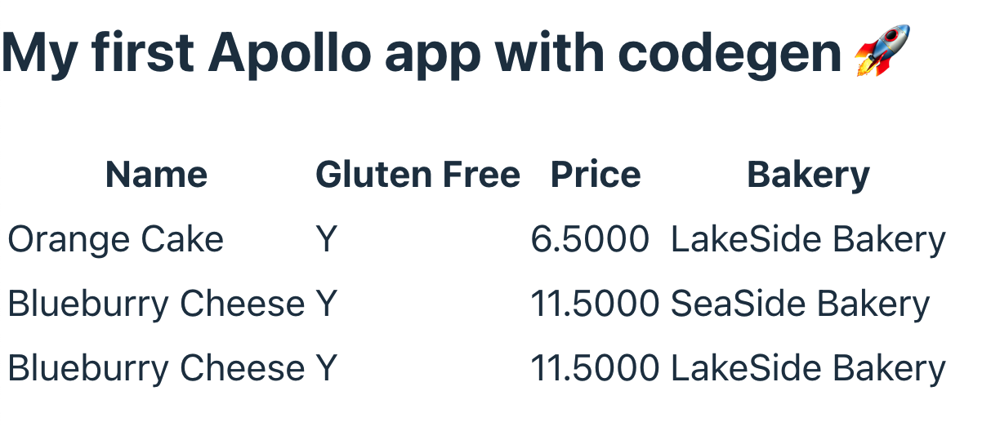

# Projects for study

## Backend

### CRUD

Inspired by `https://github.com/SeaQL/sea-orm/tree/master/examples/seaography_example`.

- Seaography
  - [x] graphql
  - [x] axum
- sea-orm
  - [x] postgresql

### Auth
- [ ] jwt sign/verify
- [ ] signin

### Apollo Router
- [ ] supergraph
- [ ] routing

## Frontend

A typical `vite-react-ts` project.
- [x] vite
- [x] react
- [x] apollo client
- [x] graphql-codegen
- [ ] jwt

